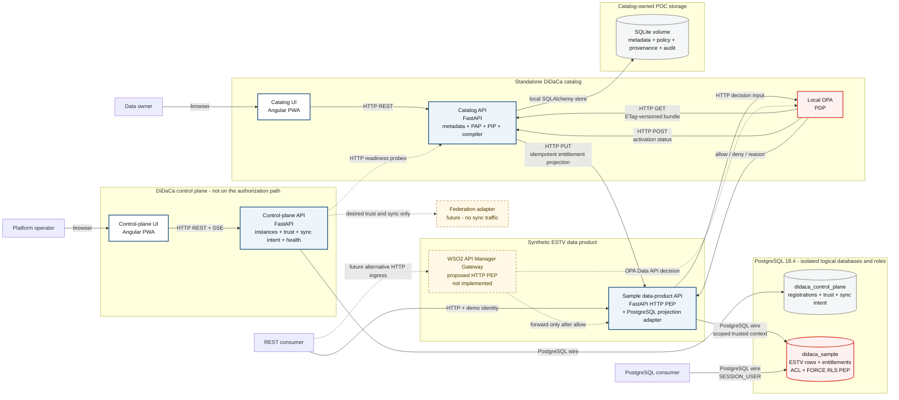
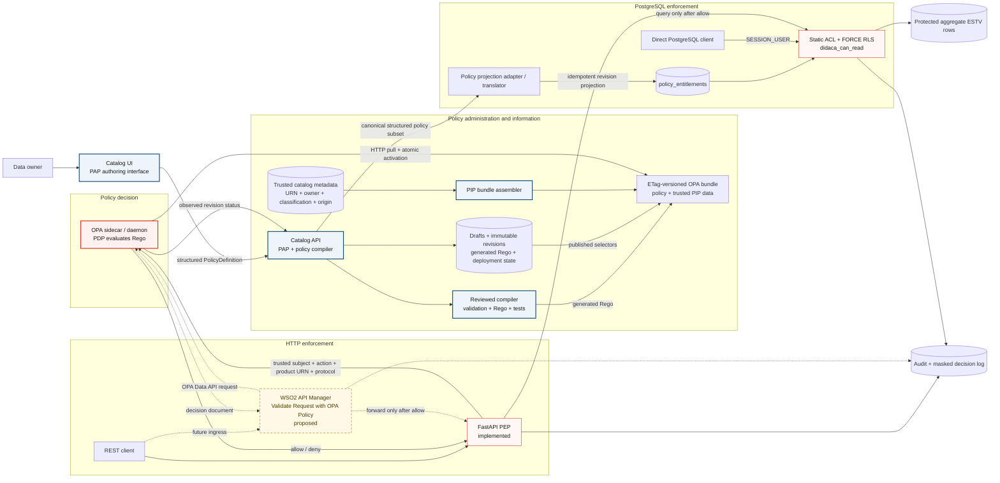

# BIT DiDaCa architecture and PBAC diagrams

These diagrams distinguish the components that are implemented in the POC from the proposed
WSO2 and federation extensions. Solid lines are implemented. Dashed lines are proposed or record
future intent only.

## 1. Component architecture

The control plane stores desired topology, directed trust, synchronization scopes, and health
observations. It is deliberately absent from the policy-decision request path. The only supported
wire protocols remain HTTP and the PostgreSQL wire protocol.

## 2. PBAC component model

The canonical source is the constrained `PolicyDefinition`, not unrestricted Rego. One reviewed
compiler emits Rego for OPA and the PostgreSQL projection adapter emits entitlement rows for the
supported relational subset. Arbitrary Rego-to-SQL translation is intentionally not attempted.

WSO2 does not load or evaluate Rego. In the proposed integration, its request-flow **Validate
Request with OPA Policy** acts as the PEP and calls the external OPA PDP. DiDaCa's current decision
is an object such as `{"allow": true, "reason": "policy_allow"}`, while WSO2's default adapter
expects a Boolean result. A small `OPARequestGenerator` adapter therefore maps authenticated WSO2
context to the DiDaCa input and reads `result.allow`; alternatively, the compiler could add a
Boolean `allow` compatibility rule. Authoritative owner, classification, origin, and resource
attributes stay in the OPA bundle/PIP data rather than caller-controlled headers.

## 3. PBAC lifecycle and protected-request activity

This activity-style flowchart covers all five use cases. The WSO2 branch is proposed; the FastAPI
and PostgreSQL branches are implemented.

```mermaid
flowchart TB
  Start(("Start")) --> A1

  subgraph A["A. Create and save a PBAC policy"]
    A1["Owner selects subject, product, action, and protocol<br/>in the Catalog PAP"] --> A2{"PolicyDefinition valid?"}
    A2 -- "no" --> A3["Return problem+json 422<br/>correct the structured policy"]
    A3 --> A1
    A2 -- "yes" --> A4["Compiler generates read-only Rego<br/>and deterministic tests"]
    A4 --> A5{"Rego compile and tests pass?"}
    A5 -- "no" --> A3
    A5 -- "yes" --> A6["Save draft with If-Match<br/>increment revision + append audit event"]
  end

  A6 --> B1

  subgraph B["B. Publish and propagate to the protected source boundary"]
    B1["Publish candidate revision with If-Match"] --> B2{"ETag current?"}
    B2 -- "missing" --> B3["428 Precondition Required"]
    B2 -- "stale" --> B4["412 Precondition Failed"]
    B2 -- "current" --> B5["Create immutable candidate revision"]
  end

  B5 --> D1

  subgraph DDeploy["D. Apply the policy to PostgreSQL through the adapter"]
    D1["Projection adapter receives the canonical<br/>supported policy subset - not arbitrary Rego"] --> D2["Map subject + product URN + action + protocol<br/>to entitlement rows"]
    D2 --> D3["Transactionally replace entitlement revision<br/>keep static ACL and FORCE RLS policy"]
    D3 --> D4{"PostgreSQL acknowledges revision?"}
  end

  D4 -- "no" --> BFail["503 deployment failure<br/>retain previous active policy"]
  D4 -- "yes" --> B6["Commit active catalog revision<br/>PostgreSQL deployed; OPA pending"]
  B6 --> B7["Expose ETag bundle<br/>generated Rego + trusted PIP data"]
  B7 --> B8["Source-side OPA polls bundle over HTTP"]
  B8 --> B9{"Bundle valid?"}
  B9 -- "no" --> BDrift["OPA keeps prior bundle<br/>report activation failure / drift"]
  B9 -- "yes" --> B10["OPA atomically activates bundle<br/>and posts observed revision"]
  B10 --> B11{"OPA and PostgreSQL revisions match?"}
  B11 -- "no" --> BDrift
  B11 -- "yes" --> Ready["Policy fully deployed"]
  Ready --> E1

  subgraph E["E. Intercept and process a protected request"]
    E1["Consumer sends request with authenticated identity"] --> E2{"Ingress protocol and deployment?"}
  end

  E2 -- "HTTP - current POC" --> H1
  E2 -- "HTTP - proposed WSO2" --> C1
  E2 -- "PostgreSQL wire" --> D5

  subgraph HttpCurrent["Current HTTP PEP"]
    H1["FastAPI authenticates demo identity"] --> H2["Build decision input from trusted identity,<br/>route/action, product URN, and protocol"]
    H2 -->|"POST OPA Data API"| H3{"OPA result?"}
    H3 -- "allow" --> H4["Query product database with<br/>transaction-local trusted context"]
  end

  subgraph C["C. Apply the policy at WSO2 - proposed"]
    C1["WSO2 Gateway authenticates request"] --> C2["Request-flow policy:<br/>Validate Request with OPA Policy"]
    C2 --> C3["DiDaCa OPARequestGenerator adapter<br/>builds trusted input and validates response"]
    C3 -->|"POST /v1/data/didaca/authz/decision"| C4{"result.allow?"}
    C4 -- "true" --> C5["WSO2 forwards trusted identity<br/>to the inner FastAPI PEP"]
  end

  subgraph DRequest["PostgreSQL runtime PEP"]
    D5["Authenticate direct database role<br/>and preserve SESSION_USER"] --> D6["Static ACL permits only intended objects"]
    D6 --> D7["FORCE RLS calls didaca_can_read<br/>against current entitlements"]
    H4 --> D8["Service role sets transaction-local<br/>trusted subject + protocol context"]
    D8 --> D7
    D7 --> D9{"Matching active entitlement?"}
  end

  C5 --> H1
  H3 -- "deny" --> Deny["403 - do not query protected data"]
  H3 -- "undefined / malformed / unavailable" --> Unavailable["503 - fail closed; do not query data"]
  C4 -- "false" --> Deny
  C4 -- "undefined / malformed / unavailable" --> Unavailable
  D9 -- "yes" --> Allow["Return permitted rows / HTTP 200"]
  D9 -- "no" --> NoRows["Direct SQL sees no rows<br/>or HTTP layer returns denial"]
  Deny --> Audit["Append masked decision / audit record"]
  Unavailable --> Audit
  Allow --> Audit
  NoRows --> Audit

  classDef action fill:#edf5fb,stroke:#0b4479,color:#171717;
  classDef decision fill:#fff8e6,stroke:#9a6700,color:#171717;
  classDef security fill:#fff1f0,stroke:#d52b1e,color:#171717,stroke-width:2px;
  classDef failure fill:#fff1f0,stroke:#d52b1e,color:#8b0000;
  classDef future fill:#fff8e6,stroke:#9a6700,color:#4a3b00,stroke-dasharray:6 4;
  class A1,A4,A6,B1,B5,B6,B7,B8,B10,D1,D2,D3,H1,H2,H4,D5,D6,D7,D8 action;
  class A2,A5,B2,B9,B11,D4,E2,H3,C4,D9 decision;
  class Ready,Allow security;
  class A3,B3,B4,BFail,BDrift,Deny,Unavailable,NoRows failure;
  class C1,C2,C3,C5 future;
```

## Design decisions behind the diagrams

- OPA bundles deliver Rego and slower-changing PIP data together. OPA pulls and activates them;
  the catalog does not push raw Rego into each PEP.
- WSO2 is a proposed outer HTTP PEP. Its gateway policy calls OPA over HTTP and allows or blocks
  the backend request from the returned decision. The existing FastAPI PEP remains as an inner,
  defense-in-depth check. WSO2 is not another PDP.
- PostgreSQL cannot safely enforce arbitrary Rego on every raw SQL statement. The adapter projects
  only the supported structured policy subset into native entitlements; static ACLs and forced RLS
  enforce those entitlements close to the data.
- Both HTTP PEP variants fail closed. A missing identity yields `401`; an explicit denial yields
  `403`; an unavailable, malformed, or undefined PDP result yields `503` before a protected query.
- Direct PostgreSQL access is filtered using `SESSION_USER`. Consumer roles are not owners,
  superusers, or `BYPASSRLS` roles.

Official references: [WSO2 OPA request validation](https://apim.docs.wso2.com/en/latest/api-security/runtime/opa-validation/overview/),
[WSO2 custom OPA request generator](https://apim.docs.wso2.com/en/latest/api-security/runtime/opa-validation/custom-opa-policy-for-regular-gateway/),
[OPA bundle distribution](https://www.openpolicyagent.org/docs/management-bundles),
[OPA REST integration](https://www.openpolicyagent.org/docs/integration), and
[PostgreSQL row security](https://www.postgresql.org/docs/current/ddl-rowsecurity.html).
