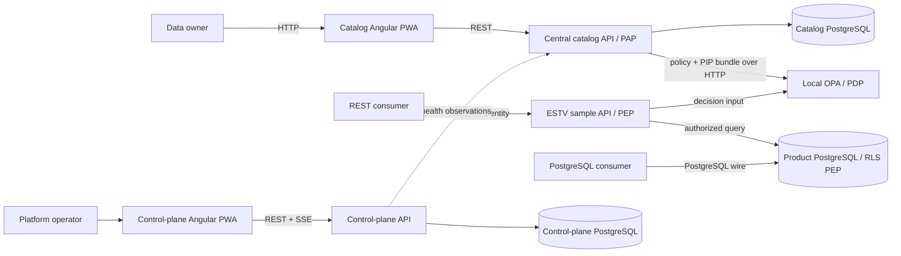

# BIT DaCa architecture

BIT DaCa is the central data catalog of the BIT data platform. Catalog metadata, product
descriptions, lineage, provenance and access policies have one authoritative catalog store.
The administrative control-plane prototype records observations and historical configuration;
it is outside the catalog's metadata and authorization request path.

## Technology choices

- **Angular 22 / Node 24**: standalone components, route-level code splitting, signals, RxJS,
  service worker support, and a long-lived enterprise UI platform. Only the shell and initial
  dashboard are eager; graphs, policy tools, audit, and administrative views are lazy.
- **Python 3.14 / FastAPI**: typed OpenAPI-first services with a natural future path to Pandas,
  Polars, PyArrow, profiling, schema inference, and lineage extraction. CPU-heavy wrangling can
  move to separate workers later without changing API contracts.
- **PostgreSQL**: persistent catalog metadata, isolated in the `daca_catalog` database and role.
  SQLAlchemy and Alembic keep the persistence boundary ready for the planned PostgreSQL migration.
- **PostgreSQL 18.4**: versioned control-plane data and direct product delivery. The local server
  contains two service-owned databases; production deployments may split them without changing
  ownership boundaries. Docker exposes it on host port `55432` because the reference workbench
  already owns the conventional local port `5432`; containers still use PostgreSQL's native 5432.
- **OPA 1.18.2**: local, fail-closed policy decisions. It consumes bundles so policy and PIP data
  activate together.

## Control-plane controls

The historical PoC prototype records instance registration/lifecycle, capability declarations, directed trust,
resource scopes, synchronization direction and schedule, policy-sync opt-in, desired/observed
revision, health, and audit. A sync configuration is configuration only: no resource is copied.
`origin-wins` remains stored in prototype records; it is not a target rule for the central catalog.

## Protocol boundary

REST, SSE, OPA decisions, and bundles use HTTP. Direct database consumers use PostgreSQL wire
protocol. SSE is an HTTP response stream, not a WebSocket. No other data-product protocol is
implemented.

## Domain and terminology boundary

The central catalog owns the governed domain register, versioned multilingual terminology,
proposal workflows, product assignments, and their JSON-LD projection. Domains are fachliche
subject areas and are never derived from the administrative organization hierarchy. Each resource
keeps a stable DaCa URN, origin identifier, monotonic revision, content hash, and retirement
marker for local traceability and controlled publication.

The knowledge graph is a read projection over PostgreSQL data and uses DCAT and SKOS vocabulary.
It is served over HTTP as JSON-LD. No graph database, SPARQL service, control-plane workflow, or
cross-catalog synchronization is part of the central operating model. See
[`domains-and-glossary.md`](domains-and-glossary.md) for governance and semantic details.

Federal organizational scope is a separate imported tree. A checked LINDAS Staatskalender
snapshot is validated and written explicitly; request handling never calls LINDAS. Modeling
resources store only the selected organization node and derive department and office from its
ancestor chain. Domains remain fachliche categories and are not derived from this tree.

## Logical and physical model boundary

The catalog persists DCAT-AP-CH dataset metadata, logical SHACL structures, imported physical
model snapshots, and DaCa asset mappings as four separate versioned layers. Physical models are
PostgreSQL tables/views or S3 Parquet objects normalized to mapping-capable fields. The S3 adapter
lists objects and reads Parquet footer metadata only; it is not a data-delivery endpoint and does
not introduce a runtime dependency on DAAIF. Logical models do
not depend on a data product, distribution, physical source, or mapping. Mappings pin exact
logical-field and physical-snapshot versions so automatic drift detection never rewrites historic
evidence. I14Y is a cached, read-only reference source; publication remains a separate disabled
port and I14Y MappingTables are not reused for physical mappings.

The complete data flow, roles, standards, fixtures, and external DAAIF user step are documented in
[`logical-models-i14y-mapping.md`](logical-models-i14y-mapping.md).

Logical model submission is an owner decision workflow, not a second publish step. The submitted
version, domain, reviewer and rendered review snapshot are immutable. DeepL Free and TERMDAT are
optional server-side assistance ports for unclassified content; their failures never block manual
authoring and their accepted output is stored with version-bound provenance.
