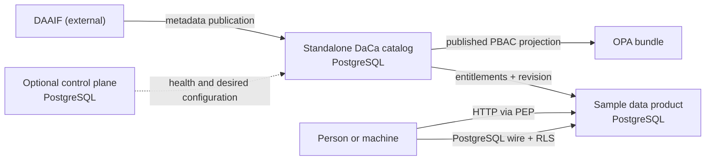

# DaCa persistent data model

This documentation is the durable reference for every persistence context owned by the DaCa
monorepo. Request and response DTOs remain documented by each service's OpenAPI document.

## Boundaries and sources of truth

- SQLAlchemy `Base.metadata` is the source for tables, columns, keys, constraints and indexes.
- Alembic is the immutable migration history; every current head and a migration fingerprint are recorded.
- PostgreSQL bootstrap and sample-product migrations are the source for roles, functions and RLS objects.
- DAAIF is external. Only the metadata publication and workflow evidence stored by DaCa are in scope.
- IDs passed between services are projections or references, not cross-database foreign keys.

Update generated sections with `npm run docs:data-model`. Validate them with
`npm run docs:data-model:check`; the root test command runs the same drift check.

<!-- BEGIN GENERATED: data-model. DO NOT EDIT. -->

| Persistence context | Storage | Tables | Alembic head | Migration fingerprint |
|---|---|---:|---|---|
| [Catalog data model](catalog.md) | PostgreSQL (`daca_catalog`; 18.4 local, 17 production) | 27 | `0010_request_policy_binding` | `1b282e400ed95e43` |
| [Control-plane data model](control-plane.md) | PostgreSQL (`daca_control_plane`) | 6 | `20260803_0001` | `ff3a5ea9ca863788` |
| [Sample data-product model](sample-data-product.md) | PostgreSQL (`daca_sample`) | 3 | `0003_weekly_availability` | `938d480b00000576` |

## Cross-service data flow

Arrows are API calls or projections, never cross-database foreign keys. The control plane is not a runtime dependency of a standalone catalog.

## Qualified table inventory

The context prefix disambiguates names such as the two independent `audit_events` tables.

- `catalog.access_requests`
- `catalog.administrative_organizations`
- `catalog.audit_events`
- `catalog.canonical_ontology_terms`
- `catalog.canonical_ontology_versions`
- `catalog.data_product_fields`
- `catalog.data_products`
- `catalog.demo_users`
- `catalog.endpoints`
- `catalog.governance_submissions`
- `catalog.identity_directory_entries`
- `catalog.identity_group_memberships`
- `catalog.identity_groups`
- `catalog.lineage_edges`
- `catalog.metadata_delivery_outbox`
- `catalog.metadata_publications`
- `catalog.ontology_term_alignments`
- `catalog.poc_product_fixtures`
- `catalog.poc_simulation_events`
- `catalog.policy_deployments`
- `catalog.policy_revisions`
- `catalog.product_context_graphs`
- `catalog.product_quality_assessments`
- `catalog.product_semantic_mappings`
- `catalog.provenance_events`
- `catalog.seed_markers`
- `catalog.workflow_tasks`
- `control-plane.audit_events`
- `control-plane.catalog_instances`
- `control-plane.deployment_observations`
- `control-plane.health_observations`
- `control-plane.sync_configurations`
- `control-plane.trust_grants`
- `sample-data-product.policy_deployments`
- `sample-data-product.policy_entitlements`
- `sample-data-product.tax_statistics`

## PostgreSQL roles and protected objects

Bootstrap fingerprint: `bd06747851cc2d9c` from [`infra/postgres/init/00-create-databases.sh`](../../infra/postgres/init/00-create-databases.sh).

Roles declared by the local Compose bootstrap:

| Role | Purpose |
|---|---|
| `daca_catalog` | Owns and runs the standalone catalog schema. |
| `daca_control` | Owns and runs the control-plane schema. |
| `daca_policy_projector` | Writes projected entitlements and deployment revisions only. |
| `daca_sample_api` | HTTP PEP database role; subject and protocol are set in the transaction. |
| `daca_sample_owner` | Migration/schema owner for the sample product; never used by consumers. |
| `kanton-bern` | Synthetic direct PostgreSQL consumer used for a denied PoC path. |
| `kanton-st-gallen` | Synthetic direct PostgreSQL consumer used for an allowed PoC path. |

Databases:

| Database | Purpose |
|---|---|
| `daca_catalog` | Standalone product metadata, workflow, policy and semantic evidence. |
| `daca_control_plane` | Control-plane registry, trust, desired sync state and observations. |
| `daca_sample` | Protected sample product data and the policy projection used by RLS. |

Sample-product security objects:

- Function `daca_can_read(target_product uuid)`
- Function `daca_effective_protocol()`
- Function `daca_effective_subject()`
- RLS `tax_statistics: enable`
- RLS `tax_statistics: force`
- Policy `daca_product_read on tax_statistics`

<!-- END GENERATED: data-model. -->
