# Catalog data model

The standalone catalog owns product metadata, workflows, access governance and semantic evidence.

**Storage:** PostgreSQL (`daca_catalog`), version 18.4 locally and version 17 in production.

## DAAIF boundary

DAAIF is an external source system and its internal data model is outside this repository. DaCa persists only the submitted publication envelope, normalized metadata, product fields and the resulting workflow evidence documented below. No DAAIF credentials or source records are stored.

<!-- BEGIN GENERATED: data-model. DO NOT EDIT. -->

- SQLAlchemy source: [`services/catalog-api/src/daca_catalog/models.py`](../../services/catalog-api/src/daca_catalog/models.py)
- Alembic head: `0006_org_custom_groups`
- Schema fingerprint: `44381a5a4f11afe1`
- Migration fingerprint: `f0682139c7ea412c`
- Tables: `26`

## Domain status vocabulary

- Product lifecycle is `draft`, `active`, `deprecated` or `retired`; classification is `public`, `internal`, `confidential` or `restricted`.
- Access requests progress through `submitted`, `identity_review`, `legal_review`, `conditions_review`, `approved_policy_pending`, a granted state, `rejected` or `withdrawn`. Granted states distinguish `granted_original` and `granted_modified`.
- Workflow task types include `metadata_quality`, `access_governance`, `access_request_review`, simulation alerts and `group_membership_changed`; task states are `open`, `in_progress` and `completed`.
- Identity sources are `federal`, `cantonal`, `municipal` and `federal_related`. Federal organizations are ordered by department and office and displayed as, for example, `EFD - BIT`. System groups are globally visible; custom groups are owner-isolated. Group membership revisions increase monotonically; existing policy snapshots never expand automatically.
- I14Y outbox entries use channel `i14y` and status `scheduled` or `simulated_delivered`; the PoC performs no external network request.
- Metadata publication modes are `governance_review` and `automatic`; stored states are `pending_review`, `published_incomplete` and `published`.
- Semantic mappings are `suggested`, `confirmed` or `unresolved`; mapping types are `product_class` and `field_property`. Ontology terms are `class`, `property` or `concept` and external alignments use `exactMatch` or `closeMatch`.
- Quality is derived from six persisted criteria: score 6 is `platinum`, 5 is `gold`, 4 is `silver`, and 0–3 is `bronze`. Fixture maturity uses `bronze`, `silver` and `gold` only.

## Persisted structured values

- `data_products.keywords` is a string array; `contact`, `quality` and physical `metadata` hold DCAT-friendly extension objects.
- `endpoints.connection` describes only HTTP/REST or PostgreSQL connectivity and never contains credentials.
- `policy_revisions.definition` is the constrained PBAC document. Each grant targets one person, machine or group, carries its validity period and independent KOBY/MCP and I14Y flags; group grants contain a server-generated membership snapshot. Generated Rego is stored separately and is not editable.
- `metadata_delivery_outbox.payload` is a DCAT-oriented metadata snapshot for the local I14Y simulation. It contains no product data and no external delivery URL.
- `metadata_publications.normalized_payload` and `poc_product_fixtures.payload` retain normalized PoC metadata, never secrets.
- `product_context_graphs.graph` stores deterministic nodes and edges; flexible provenance/audit `details` contain metadata only.

## Entity relationships

```mermaid
erDiagram
    access_requests {
        uuid id PK
        string request_number UK
        uuid data_product_id FK
        string requester_id
        string requester_name
        string requester_organization
        string contact_email
        string consumer_type
        string machine_id
        text purpose
        text legal_basis
        string requested_protocol
        string requested_variant
        date valid_from
        date valid_until
        text notes
        string status
        datetime created_at
        datetime updated_at
    }
    administrative_organizations {
        string id PK
        string department_code
        string office_code
        string display_name
        string organization_type
        integer department_order
        integer office_order
        boolean active
        datetime created_at
    }
    audit_events {
        uuid id PK
        string resource_type
        string resource_id
        string action
        string actor
        integer revision
        json details
        datetime occurred_at
    }
    canonical_ontology_terms {
        uuid id PK
        uuid ontology_version_id FK
        string uri UK
        string kind
        string label
        text definition
    }
    canonical_ontology_versions {
        uuid id PK
        string uri UK
        string version
        string title
        boolean active
        datetime created_at
    }
    data_product_fields {
        uuid id PK
        uuid data_product_id FK
        string name
        string data_type
        boolean nullable
        boolean key_field
        text business_description
        datetime created_at
        datetime updated_at
    }
    data_products {
        uuid id PK
        string urn UK
        string origin_catalog
        integer revision
        integer active_policy_revision
        string owner_user_id FK
        boolean discoverable
        string title
        text description
        string owner
        string domain
        string lifecycle
        string classification
        json keywords
        json contact
        string license
        json quality
        string update_frequency
        json metadata
        datetime created_at
        datetime updated_at
    }
    demo_users {
        string id PK
        string display_name
        string organization
        string email
        string phone
        string avatar_url
        json roles
        boolean selectable
        boolean active
        datetime created_at
    }
    endpoints {
        uuid id PK
        uuid data_product_id FK
        string name
        text description
        string protocol
        json connection
        string secret_ref
        datetime created_at
    }
    identity_directory_entries {
        string id PK
        string display_name
        string organization
        string organization_id FK
        string email
        string source
        string source_system
        boolean active
        datetime created_at
        datetime updated_at
    }
    identity_group_memberships {
        string group_id PK,FK
        string identity_id PK,FK
        date valid_from
        date valid_until
        datetime created_at
    }
    identity_groups {
        string id PK
        string label
        text description
        string source
        string owner_user_id FK
        boolean system_managed
        integer membership_revision
        boolean active
        datetime created_at
        datetime updated_at
    }
    lineage_edges {
        uuid id PK
        string source_urn
        string target_urn
        string relation_type
        text transformation
        string state
        datetime created_at
    }
    metadata_delivery_outbox {
        uuid id PK
        uuid data_product_id FK
        integer product_revision
        integer policy_revision
        string channel
        date valid_from
        date valid_until
        string status
        json payload
        datetime created_at
        datetime delivered_at
    }
    metadata_publications {
        uuid id PK
        string source_system
        string source_product_id
        uuid data_product_id FK
        string publication_mode
        boolean discoverable_explicit
        string payload_hash
        json normalized_payload
        string state
        datetime received_at
    }
    ontology_term_alignments {
        uuid id PK
        uuid term_id FK
        string target_uri
        string relation
    }
    poc_product_fixtures {
        string id PK
        string owner_user_id FK
        string source_product_id UK
        string title
        string maturity_level
        json payload
        datetime created_at
    }
    poc_simulation_events {
        uuid id PK
        string event_type
        string operation
        uuid product_id
        string product_urn
        string fixture_id
        string actor_user_id
        uuid trigger_event_id FK
        string confirmation_name
        json before_state
        json after_state
        datetime created_at
    }
    policy_deployments {
        uuid id PK
        uuid policy_revision_id FK
        string target
        integer desired_revision
        integer observed_revision
        string state
        text error
        datetime updated_at
    }
    policy_revisions {
        uuid id PK
        uuid data_product_id FK
        integer revision
        string status
        json definition
        text generated_rego
        string created_by
        datetime created_at
        datetime published_at
    }
    product_context_graphs {
        uuid data_product_id PK,FK
        json graph
        string status
        string confirmed_by
        datetime updated_at
    }
    product_quality_assessments {
        uuid data_product_id PK,FK
        boolean access_management_defined
        boolean discoverability_confirmed
        boolean technical_metadata_complete
        boolean business_metadata_complete
        boolean graph_confirmed
        boolean ontology_embedded
        boolean dcat_reviewed
        integer score
        string medal
        datetime updated_at
    }
    product_semantic_mappings {
        uuid id PK
        uuid data_product_id FK
        uuid data_product_field_id FK
        uuid ontology_term_id FK
        string mapping_type
        string status
        string confirmed_by
        datetime updated_at
    }
    provenance_events {
        uuid id PK
        uuid data_product_id FK
        string product_urn
        integer sequence
        string event_type
        string actor
        json details
        datetime occurred_at
    }
    seed_markers {
        string name PK
        datetime applied_at
    }
    workflow_tasks {
        uuid id PK
        string task_type
        string status
        string assignee_user_id FK
        uuid data_product_id FK
        uuid access_request_id FK
        uuid simulation_event_id FK
        string title
        text detail
        datetime created_at
        datetime updated_at
        datetime completed_at
    }
    data_products ||--o{ access_requests : "data_product_id"
    canonical_ontology_versions ||--o{ canonical_ontology_terms : "ontology_version_id"
    data_products ||--o{ data_product_fields : "data_product_id"
    demo_users o|--o{ data_products : "owner_user_id"
    data_products ||--o{ endpoints : "data_product_id"
    administrative_organizations o|--o{ identity_directory_entries : "organization_id"
    identity_groups ||--o| identity_group_memberships : "group_id"
    identity_directory_entries ||--o| identity_group_memberships : "identity_id"
    demo_users o|--o{ identity_groups : "owner_user_id"
    data_products ||--o{ metadata_delivery_outbox : "data_product_id"
    data_products ||--o{ metadata_publications : "data_product_id"
    canonical_ontology_terms ||--o{ ontology_term_alignments : "term_id"
    demo_users ||--o{ poc_product_fixtures : "owner_user_id"
    poc_simulation_events o|--o{ poc_simulation_events : "trigger_event_id"
    policy_revisions ||--o{ policy_deployments : "policy_revision_id"
    data_products ||--o{ policy_revisions : "data_product_id"
    data_products ||--o| product_context_graphs : "data_product_id"
    data_products ||--o| product_quality_assessments : "data_product_id"
    data_products ||--o{ product_semantic_mappings : "data_product_id"
    data_product_fields o|--o{ product_semantic_mappings : "data_product_field_id"
    canonical_ontology_terms ||--o{ product_semantic_mappings : "ontology_term_id"
    data_products o|--o{ provenance_events : "data_product_id"
    demo_users ||--o{ workflow_tasks : "assignee_user_id"
    data_products ||--o{ workflow_tasks : "data_product_id"
    access_requests o|--o{ workflow_tasks : "access_request_id"
    poc_simulation_events o|--o{ workflow_tasks : "simulation_event_id"
```

Relationships in this diagram are physical foreign keys inside this database only.

## Table reference

### `access_requests`

Requests by people or machines for time-bounded access to a data product.

| Column | Type | Null | Keys | Default |
|---|---|:---:|---|---|
| `id` | `CHAR(32)` | no | PK | — |
| `request_number` | `VARCHAR(32)` | no | UK | — |
| `data_product_id` | `CHAR(32)` | no | FK | — |
| `requester_id` | `VARCHAR(200)` | no | — | — |
| `requester_name` | `VARCHAR(255)` | no | — | — |
| `requester_organization` | `VARCHAR(255)` | no | — | — |
| `contact_email` | `VARCHAR(320)` | no | — | — |
| `consumer_type` | `VARCHAR(32)` | no | — | — |
| `machine_id` | `VARCHAR(255)` | yes | — | — |
| `purpose` | `TEXT` | no | — | — |
| `legal_basis` | `TEXT` | no | — | — |
| `requested_protocol` | `VARCHAR(32)` | no | — | — |
| `requested_variant` | `VARCHAR(32)` | no | — | — |
| `valid_from` | `DATE` | no | — | — |
| `valid_until` | `DATE` | no | — | — |
| `notes` | `TEXT` | yes | — | — |
| `status` | `VARCHAR(32)` | no | — | `submitted` |
| `created_at` | `DATETIME` | no | — | `utc_now` |
| `updated_at` | `DATETIME` | no | — | `utc_now` |

Constraints and indexes:

- Unique `unnamed`: `request_number`
- Check `ck_access_request_consumer_type`: `consumer_type IN ('person', 'machine')`
- Check `ck_access_request_dates`: `valid_until >= valid_from`
- Check `ck_access_request_protocol`: `requested_protocol IN ('http', 'postgresql', 'both')`
- Check `ck_access_request_status`: `status IN ('submitted', 'identity_review', 'legal_review', 'conditions_review', 'approved_policy_pending', 'granted_modified', 'granted_original', 'rejected', 'withdrawn')`
- Check `ck_access_request_variant`: `requested_variant IN ('original', 'modified', 'either')`
- Foreign key `data_product_id` → `data_products.id`; on delete `CASCADE`
- Index `ix_access_request_product` on `data_product_id`
- Index `ix_access_request_requester` on `requester_id`

### `administrative_organizations`

Ordered federal organization hierarchy covering the Federal Council, Chancellery, departments, offices and affiliated units.

| Column | Type | Null | Keys | Default |
|---|---|:---:|---|---|
| `id` | `VARCHAR(100)` | no | PK | — |
| `department_code` | `VARCHAR(20)` | no | — | — |
| `office_code` | `VARCHAR(40)` | yes | — | — |
| `display_name` | `VARCHAR(255)` | no | — | — |
| `organization_type` | `VARCHAR(32)` | no | — | — |
| `department_order` | `INTEGER` | no | — | — |
| `office_order` | `INTEGER` | no | — | `0` |
| `active` | `BOOLEAN` | no | — | `True` |
| `created_at` | `DATETIME` | no | — | `utc_now` |

Constraints and indexes:

- Check `ck_administrative_organization_type`: `organization_type IN ('federal_council', 'chancellery', 'department', 'office', 'affiliated')`
- Unique `uq_administrative_organization_codes`: `department_code, office_code`
- Index `ix_administrative_organization_sort` on `department_order, office_order`

### `audit_events`

Append-only catalog audit trail keyed by stable resource type and identifier.

| Column | Type | Null | Keys | Default |
|---|---|:---:|---|---|
| `id` | `CHAR(32)` | no | PK | — |
| `resource_type` | `VARCHAR(100)` | no | — | — |
| `resource_id` | `VARCHAR(255)` | no | — | — |
| `action` | `VARCHAR(100)` | no | — | — |
| `actor` | `VARCHAR(255)` | no | — | — |
| `revision` | `INTEGER` | yes | — | — |
| `details` | `JSON` | no | — | `dict` |
| `occurred_at` | `DATETIME` | no | — | `utc_now` |

Constraints and indexes:

- Index `ix_audit_resource` on `resource_type, resource_id`

### `canonical_ontology_terms`

Classes and properties belonging to one canonical ontology version.

| Column | Type | Null | Keys | Default |
|---|---|:---:|---|---|
| `id` | `CHAR(32)` | no | PK | — |
| `ontology_version_id` | `CHAR(32)` | no | FK | — |
| `uri` | `VARCHAR(500)` | no | UK | — |
| `kind` | `VARCHAR(32)` | no | — | — |
| `label` | `VARCHAR(255)` | no | — | — |
| `definition` | `TEXT` | no | — | — |

Constraints and indexes:

- Unique `unnamed`: `uri`
- Foreign key `ontology_version_id` → `canonical_ontology_versions.id`
- Index `ix_ontology_term_version` on `ontology_version_id`

### `canonical_ontology_versions`

Versioned canonical DaCa ontologies; one version can be active.

| Column | Type | Null | Keys | Default |
|---|---|:---:|---|---|
| `id` | `CHAR(32)` | no | PK | — |
| `uri` | `VARCHAR(500)` | no | UK | — |
| `version` | `VARCHAR(50)` | no | — | — |
| `title` | `VARCHAR(255)` | no | — | — |
| `active` | `BOOLEAN` | no | — | `False` |
| `created_at` | `DATETIME` | no | — | `utc_now` |

Constraints and indexes:

- Unique `unnamed`: `uri`

### `data_product_fields`

Technical schema fields and their business descriptions.

| Column | Type | Null | Keys | Default |
|---|---|:---:|---|---|
| `id` | `CHAR(32)` | no | PK | — |
| `data_product_id` | `CHAR(32)` | no | FK | — |
| `name` | `VARCHAR(255)` | no | — | — |
| `data_type` | `VARCHAR(100)` | no | — | — |
| `nullable` | `BOOLEAN` | no | — | `False` |
| `key_field` | `BOOLEAN` | no | — | `False` |
| `business_description` | `TEXT` | yes | — | — |
| `created_at` | `DATETIME` | no | — | `utc_now` |
| `updated_at` | `DATETIME` | no | — | `utc_now` |

Constraints and indexes:

- Unique `uq_data_product_field_name`: `data_product_id, name`
- Foreign key `data_product_id` → `data_products.id`; on delete `CASCADE`
- Index `ix_data_product_field_product` on `data_product_id`

### `data_products`

Catalog aggregate root for metadata, ownership, lifecycle and discoverability.

| Column | Type | Null | Keys | Default |
|---|---|:---:|---|---|
| `id` | `CHAR(32)` | no | PK | — |
| `urn` | `VARCHAR(255)` | no | UK | — |
| `origin_catalog` | `VARCHAR(255)` | no | — | — |
| `revision` | `INTEGER` | no | — | `1` |
| `active_policy_revision` | `INTEGER` | yes | — | — |
| `owner_user_id` | `VARCHAR(200)` | yes | FK | — |
| `discoverable` | `BOOLEAN` | no | — | `True` |
| `title` | `VARCHAR(255)` | no | — | — |
| `description` | `TEXT` | no | — | — |
| `owner` | `VARCHAR(255)` | no | — | — |
| `domain` | `VARCHAR(255)` | no | — | — |
| `lifecycle` | `VARCHAR(32)` | no | — | — |
| `classification` | `VARCHAR(32)` | no | — | — |
| `keywords` | `JSON` | no | — | `list` |
| `contact` | `JSON` | no | — | `dict` |
| `license` | `VARCHAR(255)` | yes | — | — |
| `quality` | `JSON` | no | — | `dict` |
| `update_frequency` | `VARCHAR(100)` | yes | — | — |
| `metadata` | `JSON` | no | — | `dict` |
| `created_at` | `DATETIME` | no | — | `utc_now` |
| `updated_at` | `DATETIME` | no | — | `utc_now` |

Constraints and indexes:

- Unique `unnamed`: `urn`
- Check `ck_product_classification`: `classification IN ('public', 'internal', 'confidential', 'restricted')`
- Check `ck_product_lifecycle`: `lifecycle IN ('draft', 'active', 'deprecated', 'retired')`
- Foreign key `owner_user_id` → `demo_users.id`

### `demo_users`

PoC identities available to the demo identity switcher.

| Column | Type | Null | Keys | Default |
|---|---|:---:|---|---|
| `id` | `VARCHAR(200)` | no | PK | — |
| `display_name` | `VARCHAR(255)` | no | — | — |
| `organization` | `VARCHAR(255)` | no | — | — |
| `email` | `VARCHAR(320)` | no | — | — |
| `phone` | `VARCHAR(100)` | yes | — | — |
| `avatar_url` | `VARCHAR(500)` | yes | — | — |
| `roles` | `JSON` | no | — | `list` |
| `selectable` | `BOOLEAN` | no | — | `True` |
| `active` | `BOOLEAN` | no | — | `True` |
| `created_at` | `DATETIME` | no | — | `utc_now` |

Constraints and indexes:

- No additional constraints or explicit indexes.

### `endpoints`

Credential-free HTTP/REST or PostgreSQL endpoint descriptions.

| Column | Type | Null | Keys | Default |
|---|---|:---:|---|---|
| `id` | `CHAR(32)` | no | PK | — |
| `data_product_id` | `CHAR(32)` | no | FK | — |
| `name` | `VARCHAR(255)` | no | — | — |
| `description` | `TEXT` | yes | — | — |
| `protocol` | `VARCHAR(32)` | no | — | — |
| `connection` | `JSON` | no | — | — |
| `secret_ref` | `VARCHAR(255)` | yes | — | — |
| `created_at` | `DATETIME` | no | — | `utc_now` |

Constraints and indexes:

- Check `ck_endpoint_protocol`: `protocol IN ('http-rest', 'postgresql')`
- Foreign key `data_product_id` → `data_products.id`; on delete `CASCADE`
- Index `ix_endpoints_data_product` on `data_product_id`

### `identity_directory_entries`

Synthetic trusted people searchable across federal, cantonal, municipal and federally affiliated sources.

| Column | Type | Null | Keys | Default |
|---|---|:---:|---|---|
| `id` | `VARCHAR(200)` | no | PK | — |
| `display_name` | `VARCHAR(255)` | no | — | — |
| `organization` | `VARCHAR(255)` | no | — | — |
| `organization_id` | `VARCHAR(100)` | yes | FK | — |
| `email` | `VARCHAR(320)` | no | — | — |
| `source` | `VARCHAR(32)` | no | — | — |
| `source_system` | `VARCHAR(100)` | no | — | — |
| `active` | `BOOLEAN` | no | — | `True` |
| `created_at` | `DATETIME` | no | — | `utc_now` |
| `updated_at` | `DATETIME` | no | — | `utc_now` |

Constraints and indexes:

- Check `ck_identity_directory_source`: `source IN ('federal', 'cantonal', 'municipal', 'federal_related')`
- Foreign key `organization_id` → `administrative_organizations.id`; on delete `SET NULL`
- Index `ix_identity_directory_organization` on `organization`
- Index `ix_identity_directory_source_name` on `source, display_name`

### `identity_group_memberships`

Time-bounded links from trusted groups to personal directory identities.

| Column | Type | Null | Keys | Default |
|---|---|:---:|---|---|
| `group_id` | `VARCHAR(200)` | no | PK, FK | — |
| `identity_id` | `VARCHAR(200)` | no | PK, FK | — |
| `valid_from` | `DATE` | yes | — | — |
| `valid_until` | `DATE` | yes | — | — |
| `created_at` | `DATETIME` | no | — | `utc_now` |

Constraints and indexes:

- Check `ck_identity_group_membership_dates`: `valid_until IS NULL OR valid_from IS NULL OR valid_until >= valid_from`
- Foreign key `group_id` → `identity_groups.id`; on delete `CASCADE`
- Foreign key `identity_id` → `identity_directory_entries.id`; on delete `CASCADE`
- Index `ix_identity_group_membership_identity` on `identity_id`

### `identity_groups`

Versioned system or owner-managed identity groups that can be captured as immutable policy snapshots.

| Column | Type | Null | Keys | Default |
|---|---|:---:|---|---|
| `id` | `VARCHAR(200)` | no | PK | — |
| `label` | `VARCHAR(255)` | no | — | — |
| `description` | `TEXT` | no | — | — |
| `source` | `VARCHAR(32)` | no | — | — |
| `owner_user_id` | `VARCHAR(200)` | yes | FK | — |
| `system_managed` | `BOOLEAN` | no | — | `False` |
| `membership_revision` | `INTEGER` | no | — | `1` |
| `active` | `BOOLEAN` | no | — | `True` |
| `created_at` | `DATETIME` | no | — | `utc_now` |
| `updated_at` | `DATETIME` | no | — | `utc_now` |

Constraints and indexes:

- Check `ck_identity_group_source`: `source IN ('federal', 'cantonal', 'municipal', 'federal_related')`
- Foreign key `owner_user_id` → `demo_users.id`; on delete `CASCADE`
- Index `ix_identity_group_source_label` on `source, label`

### `lineage_edges`

URN-based lineage relations that may refer to products outside this catalog.

| Column | Type | Null | Keys | Default |
|---|---|:---:|---|---|
| `id` | `CHAR(32)` | no | PK | — |
| `source_urn` | `VARCHAR(255)` | no | — | — |
| `target_urn` | `VARCHAR(255)` | no | — | — |
| `relation_type` | `VARCHAR(100)` | no | — | — |
| `transformation` | `TEXT` | yes | — | — |
| `state` | `VARCHAR(32)` | no | — | `active` |
| `created_at` | `DATETIME` | no | — | `utc_now` |

Constraints and indexes:

- Check `ck_lineage_state`: `state IN ('active', 'inferred', 'deprecated')`
- Index `ix_lineage_source` on `source_urn`
- Index `ix_lineage_target` on `target_urn`

### `metadata_delivery_outbox`

Deduplicated local PoC evidence for simulated I14Y metadata deliveries.

| Column | Type | Null | Keys | Default |
|---|---|:---:|---|---|
| `id` | `CHAR(32)` | no | PK | — |
| `data_product_id` | `CHAR(32)` | no | FK | — |
| `product_revision` | `INTEGER` | no | — | — |
| `policy_revision` | `INTEGER` | no | — | — |
| `channel` | `VARCHAR(32)` | no | — | `i14y` |
| `valid_from` | `DATE` | no | — | — |
| `valid_until` | `DATE` | no | — | — |
| `status` | `VARCHAR(32)` | no | — | — |
| `payload` | `JSON` | no | — | — |
| `created_at` | `DATETIME` | no | — | `utc_now` |
| `delivered_at` | `DATETIME` | yes | — | — |

Constraints and indexes:

- Check `ck_metadata_delivery_channel`: `channel IN ('i14y')`
- Check `ck_metadata_delivery_dates`: `valid_until >= valid_from`
- Check `ck_metadata_delivery_status`: `status IN ('scheduled', 'simulated_delivered')`
- Unique `uq_metadata_delivery_product_revision_channel`: `data_product_id, product_revision, channel`
- Foreign key `data_product_id` → `data_products.id`; on delete `CASCADE`
- Index `ix_metadata_delivery_status` on `status, created_at`

### `metadata_publications`

Idempotent metadata submissions received from external source systems such as DAAIF.

| Column | Type | Null | Keys | Default |
|---|---|:---:|---|---|
| `id` | `CHAR(32)` | no | PK | — |
| `source_system` | `VARCHAR(100)` | no | — | — |
| `source_product_id` | `VARCHAR(255)` | no | — | — |
| `data_product_id` | `CHAR(32)` | no | FK | — |
| `publication_mode` | `VARCHAR(32)` | no | — | — |
| `discoverable_explicit` | `BOOLEAN` | no | — | `False` |
| `payload_hash` | `VARCHAR(64)` | no | — | — |
| `normalized_payload` | `JSON` | no | — | — |
| `state` | `VARCHAR(32)` | no | — | — |
| `received_at` | `DATETIME` | no | — | `utc_now` |

Constraints and indexes:

- Unique `uq_metadata_publication_source`: `source_system, source_product_id`
- Foreign key `data_product_id` → `data_products.id`; on delete `CASCADE`
- Index `ix_metadata_publication_product` on `data_product_id`

### `ontology_term_alignments`

Optional links from local canonical terms to verified external concepts.

| Column | Type | Null | Keys | Default |
|---|---|:---:|---|---|
| `id` | `CHAR(32)` | no | PK | — |
| `term_id` | `CHAR(32)` | no | FK | — |
| `target_uri` | `VARCHAR(1000)` | no | — | — |
| `relation` | `VARCHAR(32)` | no | — | — |

Constraints and indexes:

- Unique `uq_ontology_term_alignment`: `term_id, target_uri`
- Foreign key `term_id` → `canonical_ontology_terms.id`; on delete `CASCADE`

### `poc_product_fixtures`

Deterministic external-product fixtures used by the PoC submission flow.

| Column | Type | Null | Keys | Default |
|---|---|:---:|---|---|
| `id` | `VARCHAR(200)` | no | PK | — |
| `owner_user_id` | `VARCHAR(200)` | no | FK | — |
| `source_product_id` | `VARCHAR(255)` | no | UK | — |
| `title` | `VARCHAR(255)` | no | — | — |
| `maturity_level` | `VARCHAR(32)` | no | — | — |
| `payload` | `JSON` | no | — | — |
| `created_at` | `DATETIME` | no | — | `utc_now` |

Constraints and indexes:

- Unique `unnamed`: `source_product_id`
- Foreign key `owner_user_id` → `demo_users.id`

### `poc_simulation_events`

Append-only evidence for synthetic PoC event triggers, resets and fixture deletion.

| Column | Type | Null | Keys | Default |
|---|---|:---:|---|---|
| `id` | `CHAR(32)` | no | PK | — |
| `event_type` | `VARCHAR(64)` | no | — | — |
| `operation` | `VARCHAR(32)` | no | — | — |
| `product_id` | `CHAR(32)` | no | — | — |
| `product_urn` | `VARCHAR(255)` | no | — | — |
| `fixture_id` | `VARCHAR(200)` | yes | — | — |
| `actor_user_id` | `VARCHAR(200)` | no | — | — |
| `trigger_event_id` | `CHAR(32)` | yes | FK | — |
| `confirmation_name` | `VARCHAR(255)` | yes | — | — |
| `before_state` | `JSON` | no | — | `dict` |
| `after_state` | `JSON` | no | — | `dict` |
| `created_at` | `DATETIME` | no | — | `utc_now` |

Constraints and indexes:

- Check `ck_poc_simulation_event_type`: `event_type IN ('product_submitted', 'quality_below_threshold', 'not_discoverable', 'isbo_restricted')`
- Check `ck_poc_simulation_operation`: `operation IN ('trigger', 'reset', 'product_reset')`
- Unique `uq_poc_simulation_reset`: `trigger_event_id, operation`
- Foreign key `trigger_event_id` → `poc_simulation_events.id`; on delete `RESTRICT`
- Index `ix_poc_simulation_actor` on `actor_user_id, created_at`
- Index `ix_poc_simulation_product` on `product_id, created_at`

### `policy_deployments`

Observed deployment state of one policy revision in OPA or PostgreSQL.

| Column | Type | Null | Keys | Default |
|---|---|:---:|---|---|
| `id` | `CHAR(32)` | no | PK | — |
| `policy_revision_id` | `CHAR(32)` | no | FK | — |
| `target` | `VARCHAR(32)` | no | — | — |
| `desired_revision` | `INTEGER` | no | — | — |
| `observed_revision` | `INTEGER` | yes | — | — |
| `state` | `VARCHAR(32)` | no | — | `pending` |
| `error` | `TEXT` | yes | — | — |
| `updated_at` | `DATETIME` | no | — | `utc_now` |

Constraints and indexes:

- Check `ck_deployment_state`: `state IN ('pending', 'deployed', 'failed')`
- Check `ck_deployment_target`: `target IN ('opa', 'postgresql')`
- Unique `uq_policy_deployment_target`: `policy_revision_id, target`
- Foreign key `policy_revision_id` → `policy_revisions.id`; on delete `CASCADE`

### `policy_revisions`

Versioned PBAC definitions and generated Rego for a data product.

| Column | Type | Null | Keys | Default |
|---|---|:---:|---|---|
| `id` | `CHAR(32)` | no | PK | — |
| `data_product_id` | `CHAR(32)` | no | FK | — |
| `revision` | `INTEGER` | no | — | — |
| `status` | `VARCHAR(32)` | no | — | — |
| `definition` | `JSON` | no | — | — |
| `generated_rego` | `TEXT` | no | — | — |
| `created_by` | `VARCHAR(255)` | no | — | — |
| `created_at` | `DATETIME` | no | — | `utc_now` |
| `published_at` | `DATETIME` | yes | — | — |

Constraints and indexes:

- Check `ck_policy_status`: `status IN ('draft', 'published', 'revoked')`
- Unique `uq_policy_product_revision`: `data_product_id, revision`
- Foreign key `data_product_id` → `data_products.id`; on delete `CASCADE`
- Index `ix_policy_product` on `data_product_id`

### `product_context_graphs`

KOBY Graphify PoC graph and its confirmation state.

| Column | Type | Null | Keys | Default |
|---|---|:---:|---|---|
| `data_product_id` | `CHAR(32)` | no | PK, FK | — |
| `graph` | `JSON` | no | — | `dict` |
| `status` | `VARCHAR(32)` | no | — | `suggested` |
| `confirmed_by` | `VARCHAR(200)` | yes | — | — |
| `updated_at` | `DATETIME` | no | — | `utc_now` |

Constraints and indexes:

- Foreign key `data_product_id` → `data_products.id`; on delete `CASCADE`

### `product_quality_assessments`

Server-computed evidence and medal for the six quality conditions.

| Column | Type | Null | Keys | Default |
|---|---|:---:|---|---|
| `data_product_id` | `CHAR(32)` | no | PK, FK | — |
| `access_management_defined` | `BOOLEAN` | no | — | `False` |
| `discoverability_confirmed` | `BOOLEAN` | no | — | `False` |
| `technical_metadata_complete` | `BOOLEAN` | no | — | `False` |
| `business_metadata_complete` | `BOOLEAN` | no | — | `False` |
| `graph_confirmed` | `BOOLEAN` | no | — | `False` |
| `ontology_embedded` | `BOOLEAN` | no | — | `False` |
| `dcat_reviewed` | `BOOLEAN` | no | — | `False` |
| `score` | `INTEGER` | no | — | `0` |
| `medal` | `VARCHAR(32)` | no | — | `bronze` |
| `updated_at` | `DATETIME` | no | — | `utc_now` |

Constraints and indexes:

- Foreign key `data_product_id` → `data_products.id`; on delete `CASCADE`

### `product_semantic_mappings`

Confirmed or proposed product/field mappings to canonical ontology terms.

| Column | Type | Null | Keys | Default |
|---|---|:---:|---|---|
| `id` | `CHAR(32)` | no | PK | — |
| `data_product_id` | `CHAR(32)` | no | FK | — |
| `data_product_field_id` | `CHAR(32)` | yes | FK | — |
| `ontology_term_id` | `CHAR(32)` | no | FK | — |
| `mapping_type` | `VARCHAR(32)` | no | — | — |
| `status` | `VARCHAR(32)` | no | — | `suggested` |
| `confirmed_by` | `VARCHAR(200)` | yes | — | — |
| `updated_at` | `DATETIME` | no | — | `utc_now` |

Constraints and indexes:

- Foreign key `data_product_id` → `data_products.id`; on delete `CASCADE`
- Foreign key `data_product_field_id` → `data_product_fields.id`; on delete `CASCADE`
- Foreign key `ontology_term_id` → `canonical_ontology_terms.id`
- Index `ix_semantic_mapping_product` on `data_product_id`

### `provenance_events`

Ordered, append-only history for a data product.

| Column | Type | Null | Keys | Default |
|---|---|:---:|---|---|
| `id` | `CHAR(32)` | no | PK | — |
| `data_product_id` | `CHAR(32)` | yes | FK | — |
| `product_urn` | `VARCHAR(255)` | no | — | — |
| `sequence` | `INTEGER` | no | — | — |
| `event_type` | `VARCHAR(100)` | no | — | — |
| `actor` | `VARCHAR(255)` | no | — | — |
| `details` | `JSON` | no | — | `dict` |
| `occurred_at` | `DATETIME` | no | — | — |

Constraints and indexes:

- Unique `uq_provenance_product_sequence`: `data_product_id, sequence`
- Foreign key `data_product_id` → `data_products.id`; on delete `SET NULL`
- Index `ix_provenance_product` on `data_product_id`

### `seed_markers`

Idempotency markers for deterministic PoC seed operations.

| Column | Type | Null | Keys | Default |
|---|---|:---:|---|---|
| `name` | `VARCHAR(100)` | no | PK | — |
| `applied_at` | `DATETIME` | no | — | `utc_now` |

Constraints and indexes:

- No additional constraints or explicit indexes.

### `workflow_tasks`

Owner work items for quality, access governance and request processing.

| Column | Type | Null | Keys | Default |
|---|---|:---:|---|---|
| `id` | `CHAR(32)` | no | PK | — |
| `task_type` | `VARCHAR(64)` | no | — | — |
| `status` | `VARCHAR(32)` | no | — | `open` |
| `assignee_user_id` | `VARCHAR(200)` | no | FK | — |
| `data_product_id` | `CHAR(32)` | no | FK | — |
| `access_request_id` | `CHAR(32)` | yes | FK | — |
| `simulation_event_id` | `CHAR(32)` | yes | FK | — |
| `title` | `VARCHAR(255)` | no | — | — |
| `detail` | `TEXT` | no | — | — |
| `created_at` | `DATETIME` | no | — | `utc_now` |
| `updated_at` | `DATETIME` | no | — | `utc_now` |
| `completed_at` | `DATETIME` | yes | — | — |

Constraints and indexes:

- Foreign key `assignee_user_id` → `demo_users.id`
- Foreign key `data_product_id` → `data_products.id`; on delete `CASCADE`
- Foreign key `access_request_id` → `access_requests.id`; on delete `CASCADE`
- Foreign key `simulation_event_id` → `poc_simulation_events.id`; on delete `SET NULL`
- Index `ix_workflow_task_assignee` on `assignee_user_id, status`
- Index `ix_workflow_task_product` on `data_product_id`

<!-- END GENERATED: data-model. -->
