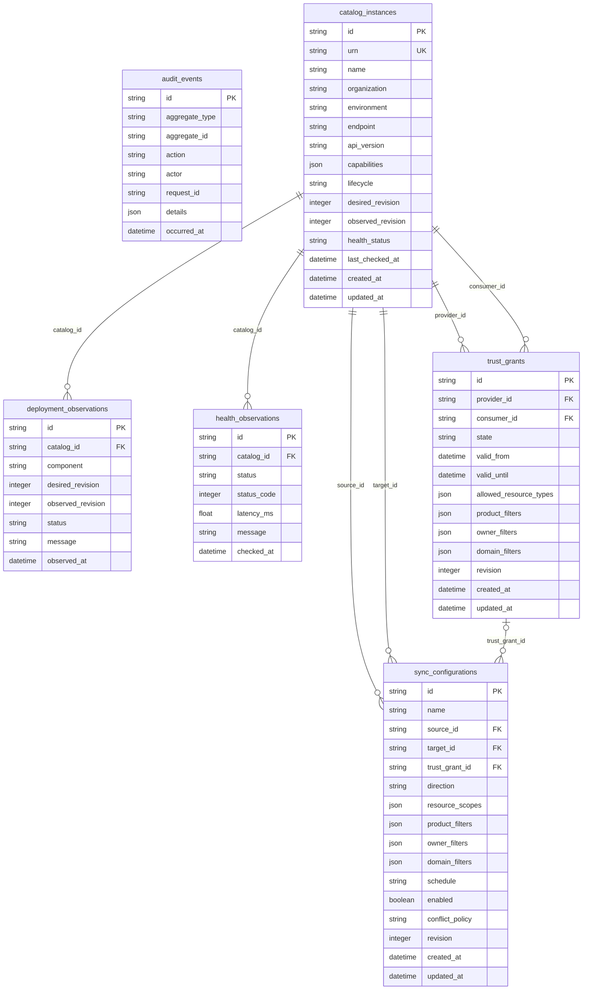

# Control-plane data model

The optional control plane observes catalogs and records desired federation configuration without becoming their runtime dependency.

**Storage:** PostgreSQL (`daca_control_plane`).

<!-- BEGIN GENERATED: data-model. DO NOT EDIT. -->

- SQLAlchemy source: [`services/control-plane-api/src/daca_control_plane/models.py`](../../services/control-plane-api/src/daca_control_plane/models.py)
- Alembic head: `20260803_0001`
- Schema fingerprint: `036db12c708dd656`
- Migration fingerprint: `ff3a5ea9ca863788`
- Tables: `6`

## Domain status vocabulary

- Catalog lifecycle is `active`, `suspended` or `retired`; health is `unknown`, `healthy`, `degraded` or `unreachable`.
- Trust grants are `pending`, `approved`, `revoked` or `expired` and are always directed from provider to consumer.
- Sync direction is `push` or `pull`; the only accepted conflict policy is `origin-wins`.
- Deployment observations are `pending`, `in-sync`, `drifted` or `failed`.

## Persisted structured values

- `catalog_instances.capabilities` and all resource/owner/domain/product filters are string arrays.
- `audit_events.details` is an extensible metadata object and must not contain secrets or protected payloads.
- Sync configuration is desired state only: no federation traffic is implemented in this PoC.

## Entity relationships

Relationships in this diagram are physical foreign keys inside this database only.

## Table reference

### `audit_events`

Append-only control-plane audit trail for configuration aggregates.

| Column | Type | Null | Keys | Default |
|---|---|:---:|---|---|
| `id` | `VARCHAR(36)` | no | PK | `new_uuid` |
| `aggregate_type` | `VARCHAR(60)` | no | — | — |
| `aggregate_id` | `VARCHAR(36)` | no | — | — |
| `action` | `VARCHAR(80)` | no | — | — |
| `actor` | `VARCHAR(200)` | no | — | — |
| `request_id` | `VARCHAR(100)` | no | — | — |
| `details` | `JSON` | no | — | `dict` |
| `occurred_at` | `DATETIME` | no | — | `utcnow` |

Constraints and indexes:

- Index `ix_audit_aggregate` on `aggregate_type, aggregate_id`
- Index `ix_audit_events_occurred` on `occurred_at, id`

### `catalog_instances`

Registered standalone catalogs and their desired/observed state.

| Column | Type | Null | Keys | Default |
|---|---|:---:|---|---|
| `id` | `VARCHAR(36)` | no | PK | `new_uuid` |
| `urn` | `VARCHAR(255)` | no | UK | — |
| `name` | `VARCHAR(200)` | no | — | — |
| `organization` | `VARCHAR(200)` | no | — | — |
| `environment` | `VARCHAR(40)` | no | — | — |
| `endpoint` | `VARCHAR(500)` | no | — | — |
| `api_version` | `VARCHAR(40)` | no | — | `v1` |
| `capabilities` | `JSON` | no | — | `list` |
| `lifecycle` | `VARCHAR(20)` | no | — | `active` |
| `desired_revision` | `INTEGER` | no | — | `1` |
| `observed_revision` | `INTEGER` | no | — | `0` |
| `health_status` | `VARCHAR(20)` | no | — | `unknown` |
| `last_checked_at` | `DATETIME` | yes | — | — |
| `created_at` | `DATETIME` | no | — | `utcnow` |
| `updated_at` | `DATETIME` | no | — | `utcnow` |

Constraints and indexes:

- Unique `unnamed`: `urn`
- Check `ck_catalog_health_status`: `health_status IN ('unknown', 'healthy', 'degraded', 'unreachable')`
- Check `ck_catalog_lifecycle`: `lifecycle IN ('active', 'suspended', 'retired')`
- Index `ix_catalog_instances_created` on `created_at, id`

### `deployment_observations`

Append-only observations of catalog configuration deployment state.

| Column | Type | Null | Keys | Default |
|---|---|:---:|---|---|
| `id` | `VARCHAR(36)` | no | PK | `new_uuid` |
| `catalog_id` | `VARCHAR(36)` | no | FK | — |
| `component` | `VARCHAR(100)` | no | — | — |
| `desired_revision` | `INTEGER` | no | — | — |
| `observed_revision` | `INTEGER` | no | — | — |
| `status` | `VARCHAR(20)` | no | — | — |
| `message` | `VARCHAR(500)` | yes | — | — |
| `observed_at` | `DATETIME` | no | — | `utcnow` |

Constraints and indexes:

- Check `ck_deployment_status`: `status IN ('pending', 'in-sync', 'drifted', 'failed')`
- Foreign key `catalog_id` → `catalog_instances.id`; on delete `CASCADE`
- Index `ix_deployment_catalog_observed` on `catalog_id, observed_at`
- Index `ix_deployment_observations_created` on `observed_at, id`

### `health_observations`

Append-only catalog health checks used for status and SSE updates.

| Column | Type | Null | Keys | Default |
|---|---|:---:|---|---|
| `id` | `VARCHAR(36)` | no | PK | `new_uuid` |
| `catalog_id` | `VARCHAR(36)` | no | FK | — |
| `status` | `VARCHAR(20)` | no | — | — |
| `status_code` | `INTEGER` | yes | — | — |
| `latency_ms` | `FLOAT` | yes | — | — |
| `message` | `VARCHAR(500)` | yes | — | — |
| `checked_at` | `DATETIME` | no | — | `utcnow` |

Constraints and indexes:

- Check `ck_health_observation_status`: `status IN ('healthy', 'degraded', 'unreachable')`
- Foreign key `catalog_id` → `catalog_instances.id`; on delete `CASCADE`
- Index `ix_health_catalog_checked` on `catalog_id, checked_at`
- Index `ix_health_observations_created` on `checked_at, id`

### `sync_configurations`

Desired, currently non-executing metadata synchronization routes.

| Column | Type | Null | Keys | Default |
|---|---|:---:|---|---|
| `id` | `VARCHAR(36)` | no | PK | `new_uuid` |
| `name` | `VARCHAR(200)` | no | — | — |
| `source_id` | `VARCHAR(36)` | no | FK | — |
| `target_id` | `VARCHAR(36)` | no | FK | — |
| `trust_grant_id` | `VARCHAR(36)` | yes | FK | — |
| `direction` | `VARCHAR(10)` | no | — | — |
| `resource_scopes` | `JSON` | no | — | `list` |
| `product_filters` | `JSON` | no | — | `list` |
| `owner_filters` | `JSON` | no | — | `list` |
| `domain_filters` | `JSON` | no | — | `list` |
| `schedule` | `VARCHAR(100)` | no | — | `manual` |
| `enabled` | `BOOLEAN` | no | — | `False` |
| `conflict_policy` | `VARCHAR(20)` | no | — | `origin-wins` |
| `revision` | `INTEGER` | no | — | `1` |
| `created_at` | `DATETIME` | no | — | `utcnow` |
| `updated_at` | `DATETIME` | no | — | `utcnow` |

Constraints and indexes:

- Check `ck_sync_conflict_policy`: `conflict_policy = 'origin-wins'`
- Check `ck_sync_direction`: `direction IN ('push', 'pull')`
- Check `ck_sync_distinct_catalogs`: `source_id <> target_id`
- Unique `uq_sync_named_route`: `source_id, target_id, name`
- Foreign key `source_id` → `catalog_instances.id`; on delete `RESTRICT`
- Foreign key `target_id` → `catalog_instances.id`; on delete `RESTRICT`
- Foreign key `trust_grant_id` → `trust_grants.id`; on delete `RESTRICT`
- Index `ix_sync_configurations_created` on `created_at, id`

### `trust_grants`

Directed trust from a provider catalog to a consumer catalog.

| Column | Type | Null | Keys | Default |
|---|---|:---:|---|---|
| `id` | `VARCHAR(36)` | no | PK | `new_uuid` |
| `provider_id` | `VARCHAR(36)` | no | FK | — |
| `consumer_id` | `VARCHAR(36)` | no | FK | — |
| `state` | `VARCHAR(20)` | no | — | `pending` |
| `valid_from` | `DATETIME` | yes | — | — |
| `valid_until` | `DATETIME` | yes | — | — |
| `allowed_resource_types` | `JSON` | no | — | `list` |
| `product_filters` | `JSON` | no | — | `list` |
| `owner_filters` | `JSON` | no | — | `list` |
| `domain_filters` | `JSON` | no | — | `list` |
| `revision` | `INTEGER` | no | — | `1` |
| `created_at` | `DATETIME` | no | — | `utcnow` |
| `updated_at` | `DATETIME` | no | — | `utcnow` |

Constraints and indexes:

- Check `ck_trust_distinct_catalogs`: `provider_id <> consumer_id`
- Check `ck_trust_state`: `state IN ('pending', 'approved', 'revoked', 'expired')`
- Unique `uq_trust_direction`: `provider_id, consumer_id`
- Foreign key `provider_id` → `catalog_instances.id`; on delete `RESTRICT`
- Foreign key `consumer_id` → `catalog_instances.id`; on delete `RESTRICT`
- Index `ix_trust_grants_created` on `created_at, id`

<!-- END GENERATED: data-model. -->
