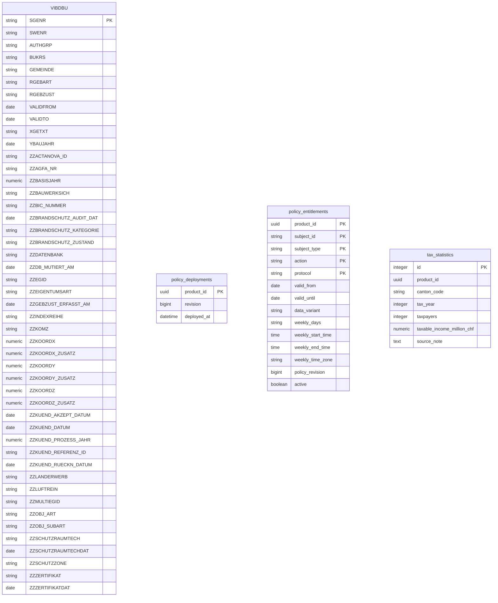

# Sample data-product model

The sample ESTV product owns synthetic product rows and the local PostgreSQL authorization projection.

**Storage:** PostgreSQL (`daca_sample`).

The RHOS presentation profile stores this model in the `daca_sample` schema of the shared
`evo1_oltp` database. It intentionally reuses the DAAIF database login for this PoC only and
does not expose direct PostgreSQL consumer credentials. Dedicated deployments retain the
separate database roles described below.

## Authorization boundary

The catalog policy revision is projected into this database by product ID and revision. This is an application-level projection, not a cross-database foreign key. OPA protects HTTP access; forced PostgreSQL RLS independently evaluates the local entitlement projection.

<!-- BEGIN GENERATED: data-model. DO NOT EDIT. -->

- SQLAlchemy source: [`services/sample-data-product/app/models.py`](../../services/sample-data-product/app/models.py)
- Alembic head: `0004_vibdbu_buildings`
- Schema fingerprint: `3800af603f66e702`
- Migration fingerprint: `62c6765d78832f77`
- Tables: `4`

## Domain status vocabulary

- Entitlement subject type is `person` or `machine`; action is currently `data.read`.
- Protocols are `http-rest` and `postgresql`; variants are `original` and `modified`.
- An entitlement is effective only when `active` is true, the current date is between `valid_from` and `valid_until` inclusive, and any optional weekday/time window matches in its IANA time zone. Window end time is exclusive.

## Persisted structured values

- The sample database contains no JSON columns. Policy grants arrive as catalog projections and are normalized into relational entitlement rows.

## Entity relationships

Relationships in this diagram are physical foreign keys inside this database only.

## Table reference

### `VIBDBU`

Synthetic SAP building master used for physical metadata browsing and logical-model derivation.

| Column | Type | Null | Keys | Default |
|---|---|:---:|---|---|
| `SGENR` | `VARCHAR(8)` | no | PK | — |
| `SWENR` | `VARCHAR(8)` | no | — | — |
| `AUTHGRP` | `VARCHAR(40)` | yes | — | — |
| `BUKRS` | `VARCHAR(4)` | no | — | — |
| `GEMEINDE` | `VARCHAR(8)` | no | — | — |
| `RGEBART` | `VARCHAR(2)` | no | — | — |
| `RGEBZUST` | `VARCHAR(2)` | no | — | — |
| `VALIDFROM` | `DATE` | no | — | — |
| `VALIDTO` | `DATE` | yes | — | — |
| `XGETXT` | `VARCHAR(60)` | no | — | — |
| `YBAUJAHR` | `DATE` | yes | — | — |
| `ZZACTANOVA_ID` | `VARCHAR(36)` | yes | — | — |
| `ZZAGFA_NR` | `VARCHAR(25)` | yes | — | — |
| `ZZBASISJAHR` | `NUMERIC(4, 0)` | yes | — | — |
| `ZZBAUWERKSICH` | `VARCHAR(1)` | yes | — | — |
| `ZZBIC_NUMMER` | `VARCHAR(20)` | yes | — | — |
| `ZZBRANDSCHUTZ_AUDIT_DAT` | `DATE` | yes | — | — |
| `ZZBRANDSCHUTZ_KATEGORIE` | `VARCHAR(2)` | yes | — | — |
| `ZZBRANDSCHUTZ_ZUSTAND` | `VARCHAR(1)` | yes | — | — |
| `ZZDATENBANK` | `VARCHAR(1)` | yes | — | — |
| `ZZDB_MUTIERT_AM` | `DATE` | yes | — | — |
| `ZZEGID` | `VARCHAR(100)` | yes | — | — |
| `ZZEIGENTUMSART` | `VARCHAR(1)` | yes | — | — |
| `ZZGEBZUST_ERFASST_AM` | `DATE` | yes | — | — |
| `ZZINDEXREIHE` | `VARCHAR(5)` | yes | — | — |
| `ZZKOMZ` | `VARCHAR(1)` | yes | — | — |
| `ZZKOORDX` | `NUMERIC(7, 0)` | yes | — | — |
| `ZZKOORDX_ZUSATZ` | `NUMERIC(7, 0)` | yes | — | — |
| `ZZKOORDY` | `NUMERIC(7, 0)` | yes | — | — |
| `ZZKOORDY_ZUSATZ` | `NUMERIC(7, 0)` | yes | — | — |
| `ZZKOORDZ` | `NUMERIC(4, 0)` | yes | — | — |
| `ZZKOORDZ_ZUSATZ` | `NUMERIC(4, 0)` | yes | — | — |
| `ZZKUEND_AKZEPT_DATUM` | `DATE` | yes | — | — |
| `ZZKUEND_DATUM` | `DATE` | yes | — | — |
| `ZZKUEND_PROZESS_JAHR` | `NUMERIC(4, 0)` | yes | — | — |
| `ZZKUEND_REFERENZ_ID` | `VARCHAR(10)` | yes | — | — |
| `ZZKUEND_RUECKN_DATUM` | `DATE` | yes | — | — |
| `ZZLANDERWERB` | `VARCHAR(50)` | yes | — | — |
| `ZZLUFTREIN` | `VARCHAR(1)` | yes | — | — |
| `ZZMULTIEGID` | `VARCHAR(1)` | yes | — | — |
| `ZZOBJ_ART` | `VARCHAR(10)` | yes | — | — |
| `ZZOBJ_SUBART` | `VARCHAR(8)` | yes | — | — |
| `ZZSCHUTZRAUMTECH` | `VARCHAR(1)` | yes | — | — |
| `ZZSCHUTZRAUMTECHDAT` | `DATE` | yes | — | — |
| `ZZSCHUTZZONE` | `VARCHAR(2)` | yes | — | — |
| `ZZZERTIFIKAT` | `VARCHAR(2)` | yes | — | — |
| `ZZZERTIFIKATDAT` | `DATE` | yes | — | — |

Constraints and indexes:

- No additional constraints or explicit indexes.

### `policy_deployments`

Latest policy revision projected into the protected PostgreSQL database.

| Column | Type | Null | Keys | Default |
|---|---|:---:|---|---|
| `product_id` | `UUID` | no | PK | — |
| `revision` | `BIGINT` | no | — | — |
| `deployed_at` | `DATETIME` | no | — | `<lambda>` |

Constraints and indexes:

- No additional constraints or explicit indexes.

### `policy_entitlements`

Time-bounded person or machine grants used by forced RLS.

| Column | Type | Null | Keys | Default |
|---|---|:---:|---|---|
| `product_id` | `UUID` | no | PK | — |
| `subject_id` | `VARCHAR(200)` | no | PK | — |
| `subject_type` | `VARCHAR(32)` | no | PK | `person` |
| `action` | `VARCHAR(100)` | no | PK | — |
| `protocol` | `VARCHAR(32)` | no | PK | — |
| `valid_from` | `DATE` | no | — | `0001-01-01` |
| `valid_until` | `DATE` | no | — | `9999-12-31` |
| `data_variant` | `VARCHAR(32)` | no | — | `original` |
| `weekly_days` | `VARCHAR(32)` | yes | — | — |
| `weekly_start_time` | `TIME` | yes | — | — |
| `weekly_end_time` | `TIME` | yes | — | — |
| `weekly_time_zone` | `VARCHAR(100)` | yes | — | — |
| `policy_revision` | `BIGINT` | no | — | — |
| `active` | `BOOLEAN` | no | — | `True` |

Constraints and indexes:

- No additional constraints or explicit indexes.

### `tax_statistics`

Synthetic aggregate ESTV records protected by the HTTP PEP and PostgreSQL RLS.

| Column | Type | Null | Keys | Default |
|---|---|:---:|---|---|
| `id` | `INTEGER` | no | PK | — |
| `product_id` | `UUID` | no | — | — |
| `canton_code` | `VARCHAR(2)` | no | — | — |
| `tax_year` | `INTEGER` | no | — | — |
| `taxpayers` | `INTEGER` | no | — | — |
| `taxable_income_million_chf` | `NUMERIC(14, 2)` | no | — | — |
| `source_note` | `TEXT` | no | — | — |

Constraints and indexes:

- Index `ix_tax_statistics_product_id` on `product_id`

<!-- END GENERATED: data-model. -->
