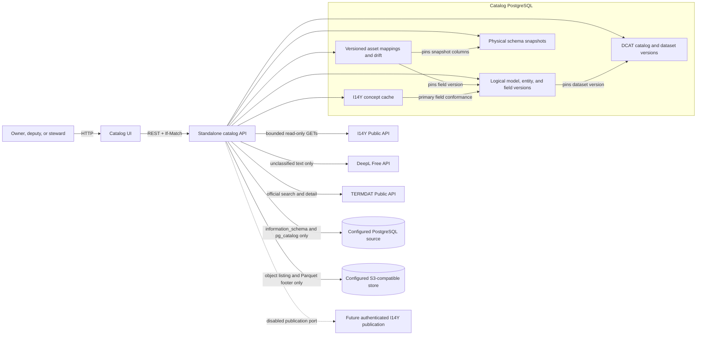
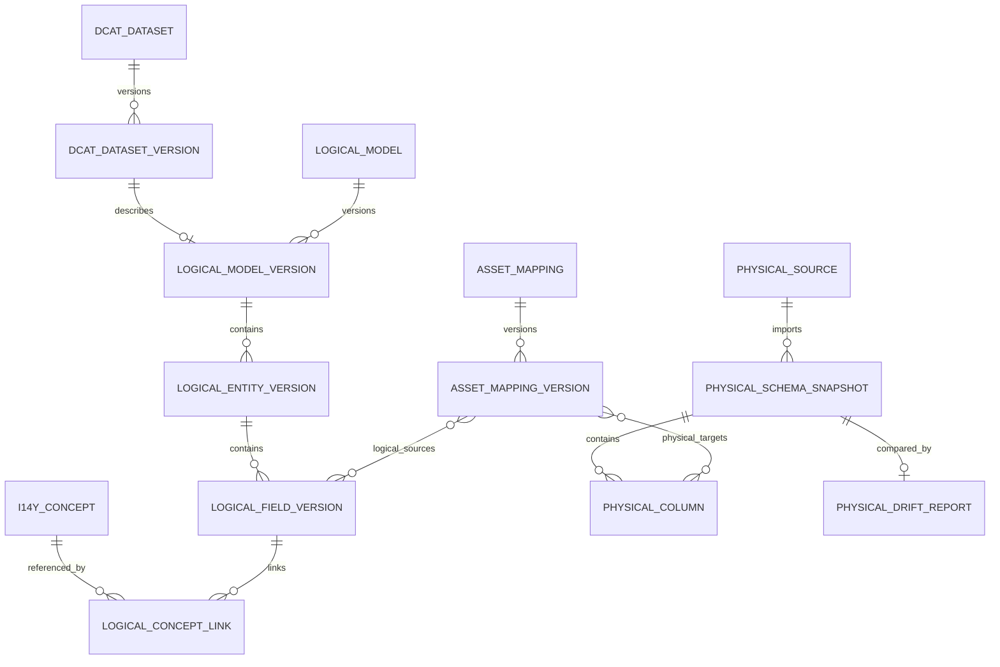

# Logical models, I14Y concepts, physical models, and mappings

This document defines the four metadata layers added to the standalone DaCa catalog.  They are
related through explicit, version-pinned references; none of them is a replacement for an
existing data product, DaCa glossary term, or I14Y MappingTable.

## Responsibilities and data flow



The control plane is not on this path.  No catalog federation traffic, I14Y write request, table
content query, or mapping transformation is performed.



The generated service-specific ER diagram in `docs/data-model/catalog.md` is authoritative for
table and foreign-key names; this diagram documents the stable architectural relationships.

## Persisted layers

### DCAT catalog layer

The catalog, dataset, distribution, and data-service resources have stable roots and immutable
versions.  A logical model pins one dataset version.  A dataset may exist without a distribution,
and a logical model may exist without a `DataProduct`, physical source, or mapping.

Dataset titles and descriptions use `de`, `fr`, `it`, `en`, and optional `rm`.  The old
`titleGe`/`descriptionGe` spelling is accepted only by the compatibility adapter.  Creators use a
discriminated `Application`, `InternalOrganisation`, `InternalPerson`, or
`ExternalOrganisationOrPerson` reference.  `dateCreated` maps to `dcterms:created`; the first
publication timestamp maps to `dcterms:issued`.  A media type is emitted only from a real
distribution.  DaCa domains and I14Y themes are deliberately separate.

A logical-model identifier is one non-empty, whitespace-free string. PostgreSQL reserves its
case-folded value in `logical_model_identifier_reservations`, atomically and catalog-wide, for the
logical-model root. A root changing its identifier releases its old reservation; current and
retired roots retain their current reservation. The organisation-derived editor mode stores its
mode on the logical-model version, while the final identifier is still the reserved value. Older
duplicate identifiers can remain unchanged for backward compatibility, but no new reservation
may claim an already reserved identifier. Physical derivations include their immutable source
snapshot in the generated identifier, so repeated derivations remain distinct.

Exports target the approved [DCAT-AP-CH 3.0.1 / eCH-0200
3.0.1](https://www.ech.ch/de/ech/ech-0200/3.0.1).  Drafts can be serialized for review, while final
publication requires title, description, identifier, publisher, and contact point.  The stricter
I14Y-readiness check additionally requires a distribution or data service.

### Logical SHACL layer

Logical models, entities, and fields have stable `urn:daca:*` identities and immutable revisions.
Fields retain business object, entity/table, name, datatype, length, description, comment,
source-system label, classification, decimals, value-list reference, `minCount`, `maxCount`, and
order independently of physical assets.

The SHACL export uses `sh:NodeShape`, `sh:PropertyShape`, `sh:path`, `sh:datatype`, `sh:minCount`,
`sh:maxCount`, `sh:name`, and `sh:order`.  DaCa does not mint identifiers in I14Y's controlled
`register.ld.admin.ch/i14y/dataset/` namespace.  Several Concepts may be associated internally,
but only one version-pinned primary link is emitted as `dcterms:conformsTo`, matching I14Y's
documented `0..1` cardinality.

Concept links, their primary Concept, and the I14Y CodeList are all optional and initially empty.
The form provides independent reset actions; resetting Concept links also clears the dependent
primary Concept and CodeList. Validation and database-integrity responses use a safe RFC-7807
problem shape with a user action, field paths, error code, request ID, and normalised support
details. SQL statements, database values, and stack traces are neither returned to the browser
nor included in the copyable support text.

### RDF namespaces

The serializers bind the following namespace IRIs. DaCa-owned catalogs, datasets, shapes, paths,
and mapping resources use stable `urn:daca:*` identifiers; the I14Y register namespace is only
used for externally minted Concept references.

| Prefix / ownership | Namespace IRI |
|---|---|
| DaCa-owned resources | `urn:daca:*` |
| I14Y-controlled references | `https://register.ld.admin.ch/i14y/` |
| `dcat` | `http://www.w3.org/ns/dcat#` |
| `dcatap` | `http://data.europa.eu/r5r/` |
| `dct` / `dcterms` | `http://purl.org/dc/terms/` |
| `rdf` | `http://www.w3.org/1999/02/22-rdf-syntax-ns#` |
| `rdfs` | `http://www.w3.org/2000/01/rdf-schema#` |
| `xsd` | `http://www.w3.org/2001/XMLSchema#` |
| `sh` | `http://www.w3.org/ns/shacl#` |
| `skos` | `http://www.w3.org/2004/02/skos/core#` |
| `foaf` | `http://xmlns.com/foaf/0.1/` |
| `vcard` | `http://www.w3.org/2006/vcard/ns#` |
| `schema` | `http://schema.org/` |
| `adms` | `http://www.w3.org/ns/adms#` |
| `locn` | `http://www.w3.org/ns/locn#` |
| `prov` | `http://www.w3.org/ns/prov#` |
| `spdx` | `http://spdx.org/rdf/terms#` |
| `gsp` | `http://www.opengis.net/ont/geosparql#` |
| `odrl` | `http://www.w3.org/ns/odrl/2/` |

### Physical model layer

A physical model is an imported, mapping-capable structure from a data source. PostgreSQL tables
and views are represented by their columns; Parquet objects in S3 are represented by the fields
embedded in their footer. A source contains versioned snapshots of these technical structures.
Search uses only metadata already persisted in the catalog PostgreSQL database and never queries
the source system at search time.
The production adapter reads only PostgreSQL `information_schema` and `pg_catalog` in a read-only
transaction.  Its DSN is a server-side secret and is never accepted by an API payload.  The
deterministic fixture adapter implements the same port and is the default for the PoC.

The source register treats one catalog path as one technical system instance. Active duplicate
registrations of that path are consolidated without merging their historical snapshots or mappings;
separate instances of the same connector type remain separate. Users can search the register by
instance name, catalog path or owner and filter it by PostgreSQL, S3/Parquet, or Oracle type and
owner. Oracle is a discoverability filter until an Oracle adapter is configured.

The source explorer presents only the newest snapshot as the primary tree while retaining older
snapshots in history. After source selection it separates database/schema/object navigation from
the active object's details. Field details include normalized and unknown technical datatypes,
length, precision/scale, nullability, and PostgreSQL comments. `Logisches Datenmodell ableiten`
appears only for a selected table, view, materialized view, or Parquet object.
In the mapping graph, the snapshot card renders the matching source-type icon, the source scope's
Data Owner, and the complete canonical catalog path with the immutable revision, so the selected
representation remains unambiguous without reopening the explorer.
Edges are derived from the rendered source and target connector centres rather than a fixed card
height, preserving their attachment when representation metadata changes the layout.

The released PostgreSQL example `daca_sample.public.VIBDBU` has exactly the 47 columns declared by
`tests/VIBDBU.csv` and 1'000 deterministic, plausible building records in every deployed
environment. Its matching credential-free structural snapshot is seeded in the catalog, so the
source is immediately browseable; DaCa never copies a data row into the catalog.

Every import creates an immutable snapshot and compares it with its predecessor.  Drift covers
additions, removals, datatype, length, precision, scale, and nullability.  Rename similarity is an
explicit review candidate and is never silently accepted.

### DaCa asset-mapping layer

An asset mapping pins one logical model/field revision and one physical snapshot/column set.  Both
sides are many-to-many so one business field can have several representations and derived targets
can consume several source fields.  Supported mapping types are `Direct`, `Renamed`, `Derived`,
`Lookup`, and `Transformed`; rules are stored and validated but never executed.

Physical-first starts with one object and reuses the complete logical-model editor. Its save calls
`POST /api/v1/physical-tables/{tableId}/derive-logical-model` with a `logicalModel` write aggregate
and transient `{physicalColumnId, entityName, logicalFieldName}` bindings. The model and all
initial mappings are committed once. An unchanged field name produces `Direct`; an edited name
produces `Renamed`. Deleting a derived field deletes only that unsaved candidate.

Additional physical representations are selected from the same explorer in model context. The
workspace lists every representation already linked through mappings and constrains graph/matrix
to one active representation. It proposes only unique, case-insensitive exact-name pairs whose
normalized types agree. Type conflicts, ambiguity, missing names, fuzzy candidates, M:N mappings,
and transformations remain explicitly manual.

Mapping versions move through `draft`, `review_pending`, `validated`, `broken`, and `superseded`.
Schema drift appends a system-authored `broken` successor while preserving the previously
validated evidence.  Resolution is a deliberate user-authored version against the latest
snapshot.

## Roles and demo scenarios

Modelling authorization is scoped to the `VBS / Verteidigung` organization and does not change
legacy data-product permissions.

| Persona | Modelling role | Scenario |
|---|---|---|
| Christian Spider | Data Owner | Owner of the logical-first personnel model |
| Sibilla Micheli | Deputy Data Owner | Visible personnel-model deputy |
| Cinthya Thor | Data Steward | Logical-first editing and existing-to-existing mapping |
| Lawrence Hill | Data Owner | Owner of the vehicle-inventory model |
| Hong An Captain | Deputy Data Owner | Visible vehicle-model deputy |
| Christian Man | Data Steward | PostgreSQL import and derivation |
| Giuseppe Starwars | Data Owner | armasuisse owner persona |
| Thomas Wikinger | Data Steward | armasuisse steward persona |

Data Owners and deputies may view and edit models in scope. The primary Domain Owner alone receives
and decides a logical-model review task in this PoC. Data Stewards may
edit models and fields, import technical metadata, associate I14Y Concepts, create and validate
mappings, and submit for review, but cannot publish.

Federal modeling scope is an imported, validated hierarchy stored in PostgreSQL. The checked
offline snapshot contains exactly the Federal Chancellery plus EDA, EDI, EJPD, VBS, EFD, WBF and
UVEK below the federal root. The reference chain is
`VBS → Bundesamt für Rüstung armasuisse (20005536) → armasuisse Immobilien (20053180)`.
The UI labels intermediate levels “Amt/Verwaltungseinheit” and “Abteilung/Bereich” because the
source taxonomy is not uniform. Persons have one active primary membership; owner searches rank
the same office first, then the same department, then the rest of the Confederation.

The Immobilienmanagement journey adds Mirjam Keller as Data Steward, Daniel Wenger as primary
domain owner and Eliane Rossi as his active deputy. Its controlled business-object terminology
contains `Immobilienobjekt`, `Infrastrukturbedarf` and `Bauprojekt`. The selected domain binds
Daniel and Eliane from the domain register; a draft save creates no task. A separate steward
submission creates an immutable review snapshot and personal task for Daniel, which links directly
to the review workspace. Acceptance creates the published successor and
sets `dct:issued`; rejection requires a comment and returns a `changes_requested` successor to the
submitting steward.

Logical-model reads are catalog-wide. Writes use the existing PostgreSQL-backed organisational
hierarchy: a user's assigned department, office, or division permits the corresponding subtree;
otherwise a model remains readable but is disabled in the editor. The selected DaCa domain is the
authoritative server-side source for the primary owner and visible deputy. Saving a draft never
creates a task; explicit submission creates exactly one immutable review snapshot and one task for
the primary owner. The deputy has no decision right.

## Language and terminology assistance

Title blur requests FR, IT and EN translations from DeepL Free and silently prefetches TERMDAT
after three characters. Description blur requests translations only. RM stays manual unless a
selected TERMDAT result supplies it. Calls are server-side, use a ten-second timeout and are
strictly limited to `unclassified` content. Missing configuration or provider errors leave the
form fully usable.

Empty language fields are filled and marked as machine-generated. Existing values are never
overwritten: an accessible comparison overlay offers individual accept or discard actions.
Responses are keyed by the German source hash, and stale responses are ignored after source edits.
Accepted values persist provider, field/language, source identifier/URI, source and payload hashes,
retrieval time and origin on the immutable logical-model version.

TERMDAT collections and classifications are cached for 24 hours and passed explicitly to the
official search API. Literal title searches cover term, name, abbreviation and phraseology fields,
but not definitions. The server first requests summary hits with one input language and then loads
only those entry IDs in four parallel, language-specific `/Entry` requests. This follows the public
contract, whose `OutLanguageCode` accepts one language per request, while retaining DE, FR, IT, EN
and available RM details in the picker. Leaving the German title field starts this lookup and shows
an accessible hit banner immediately; opening the modal is still an explicit user action. A formal
definition is preferred when copying a description, followed transparently by TERMDAT note and
usage-context fields when the entry has no definition. The picker supports title-only,
description-only and combined title-and-description adoption. Existing content is never changed
through a native browser prompt: an in-modal comparison shows the current and proposed values and
requires confirmation through the explicit `Auswahl übernehmen` action.

Only entries exposed by the TERMDAT Public API can be selected. The TERMDAT website may display
in-progress or legacy-collection entries that the Public API and LINDAS register do not publish;
an empty result is therefore shown separately from provider unavailability. Importing a result
records source provenance only; semantic equality is never inferred. The public API and register
URI are official integration points, but the reuse licence is not sufficiently explicit for
production and needs Federal Chancellery confirmation.

The three deterministic journeys are:

1. **Logical first:** create and reopen `Mitarbeitende` without product, distribution, physical
   asset, or mapping; associate cached Concepts and export DCAT/SHACL.
2. **Physical first:** open `Bestehende Datenquellen`, enter the PostgreSQL source and inspect
   `logistics.vehicle_inventory` or `daca_sample.public.VIBDBU`. The table actions menu derives a
   technical logical draft and all exact 1:1 mappings atomically, then opens the mapping workspace.
   The source scope must already resolve to one governed domain; DaCa never guesses one from table
   names. The edge reads `1:1 · wird repräsentiert durch` from logical to physical and
   `abgeleitet aus` in reverse. Then add another representation, review exact 1:1 proposals, and
   verify both representations on the same model.
3. **Existing to existing:** connect `Organisationseinheiten` to
   `hr_core.public.org_unit` in graphical and keyboard/table modes, then inspect drift after the
   second fixture import.

`Datenquellen` is exposed in the main navigation between `Meine Datenprodukte` and
`Domäne und Terminology`. Its hierarchy deliberately reuses DAAIF's visual vocabulary for server,
PostgreSQL provider, database, schema, table and view nodes.
Any table with a persisted mapping to a logical model shows a model icon before its compact `…`
context-menu control. Its hover/focus tooltip reports that link independently of mapping status.
The tooltip closes immediately when the pointer leaves the icon. Its `Referenziertes logisches
Modell öffnen` menu action is enabled and opens the linked model's mapping workspace with the
physical snapshot and table preselected.
The model overview records the `Geändert` timestamp with date and local time.

After a physical-first derivation the mapping workspace keeps the graph or matrix visible and opens
the selected logical field in a persistent editor on the right. `/models/new` and
`/models/:id/edit` use the same extracted Angular field-characteristics component. Their structure
area is a selectable field table with add/remove actions and a `Tabelle`/`Relation` switch; only the
selected field's controls are rendered. The shared editor covers the complete field contract:
business-object decisions, editable name and type, length, precision, scale, order, nullability,
`minCount`/`maxCount`, classification, source system, description, comment and I14Y links. Values
justified by the selected immutable snapshot are prefilled; business meaning is never guessed.
Removing or renaming a field therefore remains an explicit model edit without duplicating a second
editor implementation or taking the user out of mapping context. `Model Merkmale` remains a
separate model-level section. Contextual help is opened
from the field title on hover or keyboard focus, is positioned above it where space permits,
repeats the title hidden underneath, and closes as the pointer leaves the title; no standalone
information icon is rendered. At most one field-help tooltip is visible at a time.

## I14Y Public API contract and cache

DaCa validates the official
[`Release.json`](https://apiconsole.i14y.admin.ch/public/v1/Release.json) at synchronization time
and chooses the server described as `PROD`.  The verified 2026-08-26 contract is OpenAPI 3.0.4,
API `v1`, deployment `1.15.4-build.45`, SHA-256
`78e1a82d3bbf91704596a7aec6bfa56f076913fa4639f945a5f90fedd94c1b04`.

The read port covers Agents, Catalogs, Concepts, DataServices, Datasets, MappingTables,
PublicServices, and Search.  Concepts are paged from `/concepts`; headers named `x-paging-*` are
authoritative.  Code-list entries are loaded only on demand.  The transport accepts known live
contract deviations such as a missing `responsiblePerson`, extra `replaces`/`isReplacedBy`, and
the absence of deprecated `identifier`, then normalizes to the persisted shape.  A failed refresh
does not erase the last complete cache.

Offline compatibility fixtures use:

- Concept `legalForm`, UUID `89bc55cc-3858-4c13-a5c8-7dc935dff29b`, version `1.2.0`, permalink
  `https://register.ld.admin.ch/i14y/concept/legalForm/version/1.2.0`;
- Dataset `ce087cbd-83a5-409f-a0c7-41175c6d5e0d`, identifier
  `CH_KT_BL_dataset_12480`, with real `Ttl` and `JsonLd` structure exports.

The capture session started at `2026-09-07T18:41:55Z`; the JSON-LD structure export was captured
at `2026-09-07T18:53:36Z`. The fixture manifest records the source URL, exact UTC retrieval time,
upstream byte count and SHA-256 where the original response was retained as evidence, and byte
count plus SHA-256 for every checked-in sanitized fixture. Tests use these recorded fixtures only.

### I14Y operator commands

The UI never performs a complete sync at startup. All network-backed reads are explicit operator
actions by a modelling persona. The local search endpoint remains cache-only; `remote-search`
queries I14Y without mutating the cache.

```powershell
$conceptId = "89bc55cc-3858-4c13-a5c8-7dc935dff29b"

# Full paginated Concept-cache synchronization and local status
curl.exe -X POST -H "X-DaCa-User: cinthya.thor" `
  http://localhost:8001/api/v1/i14y/concepts/sync
curl.exe -H "X-DaCa-User: cinthya.thor" `
  http://localhost:8001/api/v1/i14y/sync-status

# Explicit remote search; this does not update the local cache
curl.exe --get -H "X-DaCa-User: cinthya.thor" `
  --data-urlencode "q=Rechtsform" `
  http://localhost:8001/api/v1/i14y/concepts/remote-search

# Refresh one Concept detail into the local cache
curl.exe -X POST -H "X-DaCa-User: cinthya.thor" `
  "http://localhost:8001/api/v1/i14y/concepts/$conceptId/refresh"

# Synchronize only that CodeList's entries
curl.exe -X POST -H "X-DaCa-User: cinthya.thor" `
  "http://localhost:8001/api/v1/i14y/concepts/$conceptId/code-list-entries/sync"
```

## DAAIF physical-object reference contract

DAAIF is the technical workbench for acquired sources; DaCa owns the logical-model, field,
physical-snapshot, mapping and drift records. A cross-system reference is deliberately not a
database foreign key. Once a Data Owner or Steward has validated an asset mapping, DAAIF may hold
only: its physical object ID/path, the DaCa logical-model URN, the exact model and mapping
revision, the mapping status and a DaCa deep link. It must not copy the logical schema, data rows,
credentials, S3 content or view definition.

`draft`, `broken` and `superseded` mappings do not establish business context in DAAIF. A new
validated mapping revision is required after physical drift. DaCa Journey 02 links to DAAIF's
metadata-only source explorer; DAAIF's **Education & Documentation → User Journeys** links back
to DaCa's model and mapping views. This gives analysts a two-way navigable journey while keeping
both PostgreSQL persistence models independent.

## External DAAIF user step

DAAIF has a separate repository and no user-seeding API.  Check or apply Christian Spider's four
known UI/backend allow-list entries explicitly:

```powershell
uv run python scripts/seed_daaif_christian_spider.py --repo <daaif-repository> --check
uv run python scripts/seed_daaif_christian_spider.py --repo <daaif-repository> --apply
```

`--apply` validates every expected file before writing and creates one `.daca-seed.bak` backup per
changed file.  This external step does not imply or document a DAAIF persistence model.
