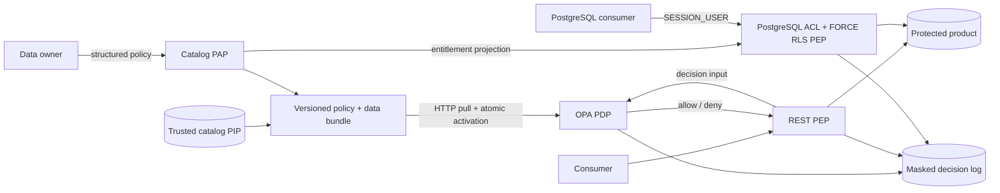
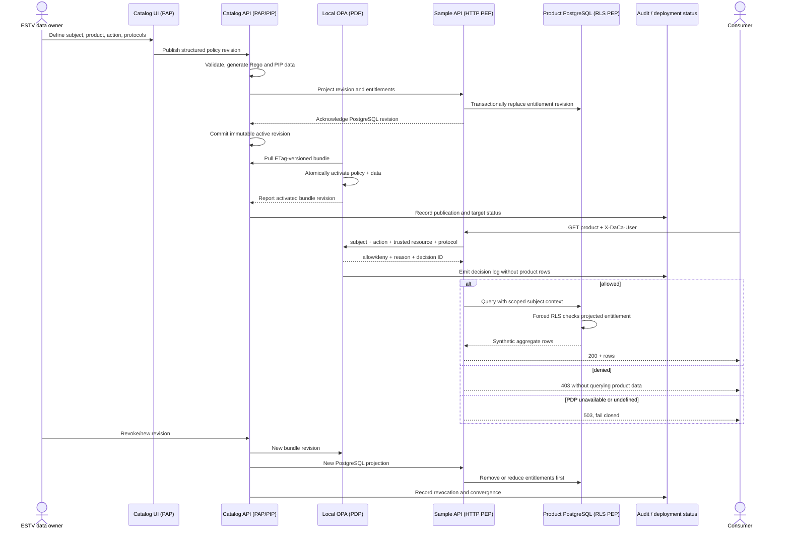

# PBAC policy flow

The POC demonstrates policy-based access control for one synthetic ESTV product. The only allowed
subject is `kanton-st-gallen`; `kanton-bern`, a missing identity, an unknown protocol, and every
other combination are denied by default.

## Components

- **PAP** — the catalog UI and API store the structured policy, generate Rego, validate it, and
  publish an immutable revision.
- **PIP** — product ownership, classification, origin, and endpoint details come from the trusted
  catalog database and are placed in the OPA bundle. Request method/action and the development
  subject identity are supplied by the PEP.
- **PDP** — OPA evaluates `data.daca.authz.decision` locally.
- **HTTP PEP** — the sample FastAPI dependency rejects before it reads PostgreSQL.
- **PostgreSQL PEP** — ACLs plus `FORCE ROW LEVEL SECURITY` consult the projected entitlement by
  `SESSION_USER`; the service login may supply request context only for its own session.

On publication or revocation, failure to deploy the PostgreSQL projection returns `503` and
retains the previous active catalog policy; stale direct-database access is not silently presented
as converged. A revision is shown as fully deployed only after OPA and PostgreSQL acknowledge it.

## Why PostgreSQL does not call OPA per statement

PostgreSQL has no built-in transparent OPA hook for arbitrary raw SQL. OPA SQL filtering can help
a managed query layer construct predicates, but it cannot stop a raw client from reaching an
unprotected base table. This POC therefore projects the constrained policy into native
entitlements and forced RLS. A production system that requires a live OPA decision for every
connection/query would need a mandatory PostgreSQL-aware gateway or a broker issuing short-lived
credentials; that is deliberately outside this lean POC.

## Production hardening deferred from the POC

Replace the development header with validated OIDC claims; add TLS/mTLS, signed and persisted OPA
bundles, short-lived PostgreSQL identities, external secret management, revocation/session rules,
decision-log masking, and deployment monitoring. OPA input and decision logs may contain sensitive
attributes and must not be retained unfiltered.
